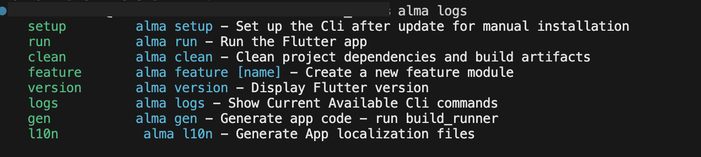

# Almaviva CLI 🚀

A powerful command-line tool for Flutter/Dart project management, scaffolding, and build automation.

## Features

- 🛠️ Project setup & initialization
- 🏗️ Module/feature scaffolding
- 🏃 Run projects with environment configurations
- 🧹 Clean builds & dependencies
- 🔍 CLI status checks
- ⚡ Build runner integration



## Installation

### From GitHub (Latest Version)
```bash
dart pub global activate --source git https://github.com/rehamahmd/almaviva_cli.git
```
`Activate globally`
```bash
nano ~/.zshrc
echo 'export PATH="$PATH:$HOME/.pub-cache/bin"' 
source ~/.zshrc
```


## Alternative Installation (Manual Build)

### Clone and Compile
```bash
git clone https://github.com/rehamahmd/almaviva_cli.git
cd almaviva_cli
dart compile exe bin/almaviva_cli.dart -o alma
```
`Activate globally`
```bash
sudo mv alma /usr/local/bin/
sudo chmod +x /usr/local/bin/alma
```

###  ALL Available commands
```bash
alma logs
```


## Uninstalling
### 1. Deactivate Package
```bash
dart pub global deactivate almaviva_cli
```
### 2. Clear cach
```bash
# Remove binary
sudo rm /usr/local/bin/alma

# Clear cache
rm -rf ~/.pub-cache/bin/alma*
rm -rf ~/.pub-cache/global_packages/almaviva_cli*
```


---
Note: CLI still under development 